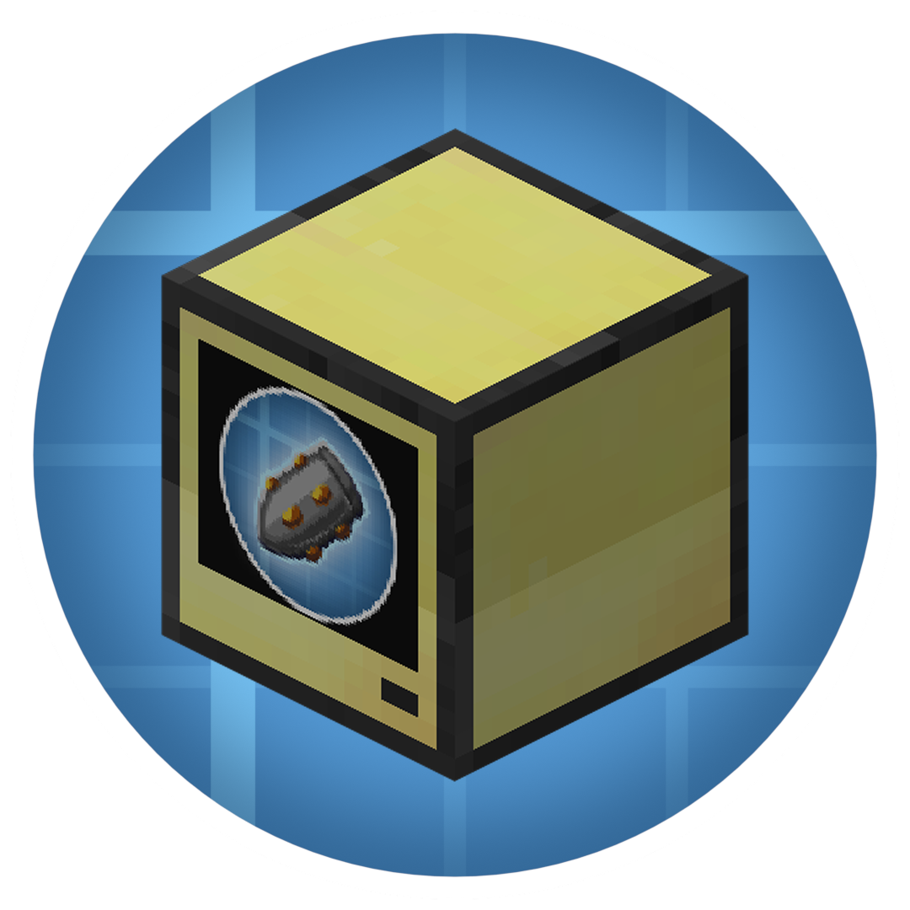

# Create Big Cannons: Peripheral

  

> This mod adds CC: Tweaked peripherals to Create Big Cannons

## Downloading
Mod is available at Modrinth and GitHub releases.

- Modrinth (might be still under review): https://modrinth.com/project/cbcperipheral
- GitHub Releases: https://github.com/nosqd/cbcperipheral/releases

Also nightly builds available as GitHub Actions artifacts: https://github.com/nosqd/cbcperipheral/actions

## Peripheral API
API Documentation is available here: https://github.com/nosqd/cbcperipheral/wiki/Peripherals

## Developing
Mod uses nothing harder than Gradle. So you can fire up Intellij IDEA and start writing code.

## Contributing
All contributions are allowed, mod's code and all its assets are licensed as MIT. 

## History
Mod is based on code of VS: Addition, but I wanted to make it physics engine agnostic.